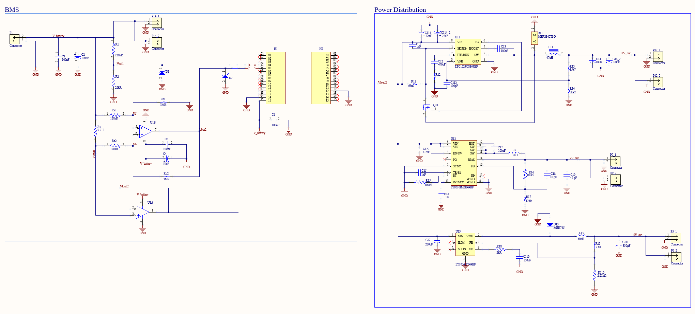
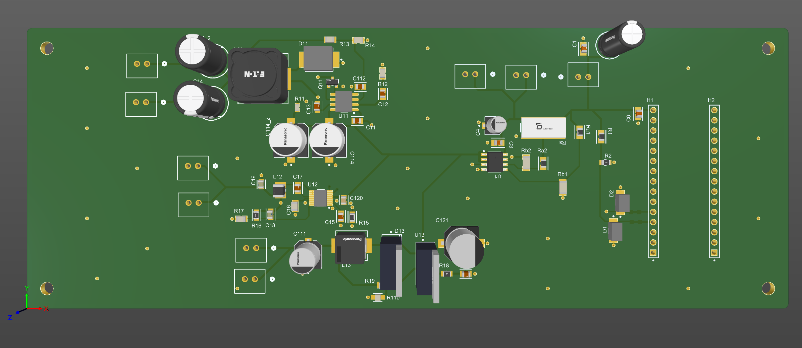
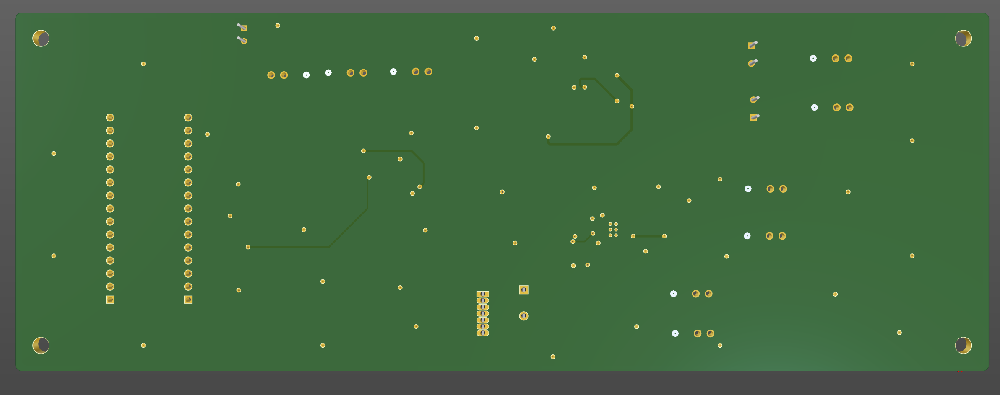

# Project Overview
Create a PCB for a new power ditribution and battery managment system to replace old design. Design is to fit on a 20 cm $\times$ 7 cm board and fix overheating issue on previous design.
# Schematic

# Front PCB View

# Back PCB View

