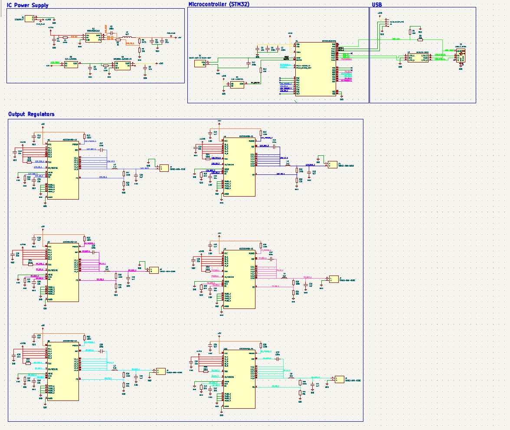
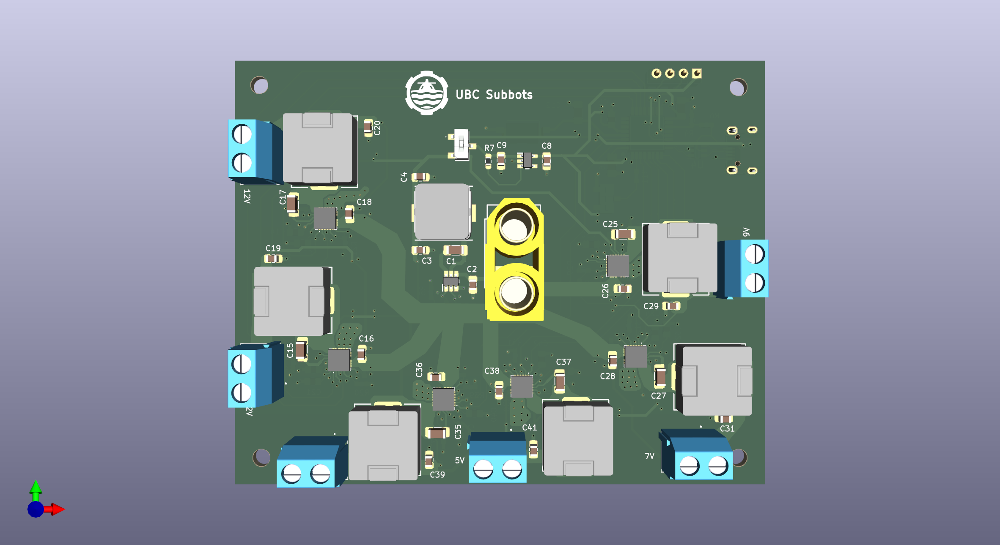
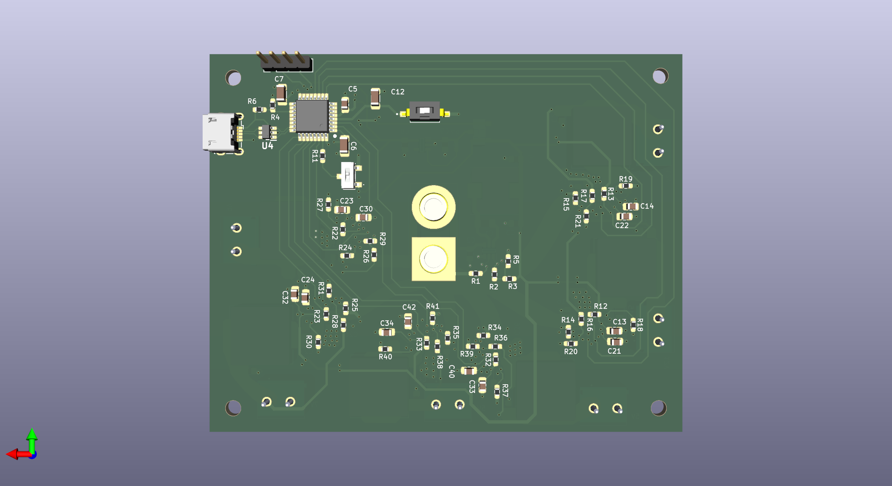

# PDB
Power distribution PCB (100mm x 80mm)

Step down battery voltage (14.8 nominal) to 12V, 9V, 7V, and 5V with 15A current amapacity each. 

Microntroler (STM32) handles:
+ undervoltage and overcurrent protection faults from regulators
+ enable control from main computer via USB
+ watchdog for main computer (soft restart when main computer freezes)

# Schematic:

# Layout
Front:

Back:
